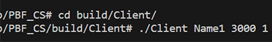
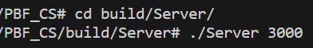

## Building and Run 

### Linux 

1. Create a build directory: `mkdir build && cd build`
2. Run CMake to configure the project: `cmake ..`
3. Build the project: `cmake --build .`
4. Run the executable generated in the build directory.

#Or 

1. Enter in terminal: `sh build.sh`

### Start Server & Client 

1. cd folder build/server
2. Enter terminal `./Server <port>` 
3. cd folder build
3. Enter terminal `./Client <client_name> <server_address> <server_port> <period>`

## Screenshots

